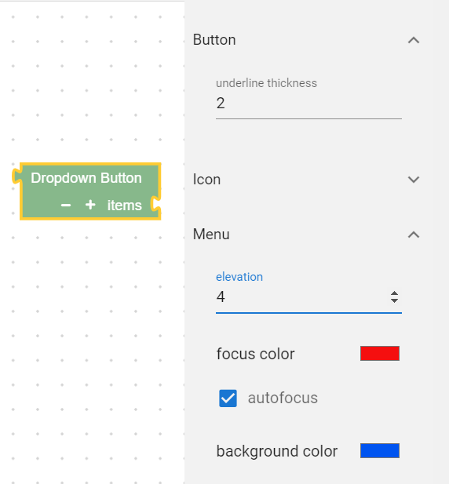

# irithm frontend task

This task is for applicants for **Front-end developer** position at **irithm**. It is inspired by actual tasks undertaken by developers in their normal work. The project is built using [Vue.js](https://vuejs.org/), [Nuxt.js](https://nuxtjs.org/), [Vuetify](https://vuetifyjs.com/en/), [Typescript](https://www.typescriptlang.org/), and [Blockly](https://developers.google.com/blockly) (No knowledge of Blockly is required).

The page is divided into 3 sections: a ready Blockly workspace (with minimal blocks), the property pane, and an XML preview for verification. All the work is to be done in the property pane.

## Task description

The task is to build the property pane in such a way that it is exposes the properties defined on [the blocks](./plugins/blockly/blocks) to the user in such a way that they can easily edit those properties. Each block definition (`.ts` file) defines an object that has a `properties` key whose content depends on that block. This object needs to the single source of truth (the view has to modify it directly) such that the block can be exported with its data at any time.

Try to make the solution flexible (blocks control how their data is exposed) and well-architected (for easier extensibilty and future-proofness) such that it can easily be modified in the future.
Try to demonstrate your knowledge of Vue and Typescript.

Adding unit tests is a bonus.

Feel free to modify any files as seems appropriate.

### Example

An example for the final result is shown below:


## Judgement criteria

The implementation will be judged according to the following (no specific scheme):

- Code style (cleanliness, minimality, appropriate variable names, ...)
- Code architecture (communication different components, design patterns, ...)
- User interface beauty (of property pane only)
- Appropriate use of Vue/Typescript features

## Useful Resources

- [Design Patterns](https://sourcemaking.com/design_patterns)
- [Vuetify components](https://vuetifyjs.com/en/components/api-explorer/)
- [Nuxt guide](https://nuxtjs.org/guide)
- [Vue render function and Functional Components](https://vuejs.org/v2/guide/render-function.html)
- [Blockly.Block API reference](https://developers.google.com/blockly/reference/js/Blockly.Block)
- [Model answer to the task](https://www.youtube.com/watch?v=dQw4w9WgXcQ)

## Build Setup

```bash
# install dependencies
$ npm install

# serve with hot reload at localhost:3000
$ npm run dev

# build for production and launch server
$ npm run build
$ npm run start

# generate static project
$ npm run generate
```


For detailed explanation on how things work, check out [Nuxt.js docs](https://nuxtjs.org).
